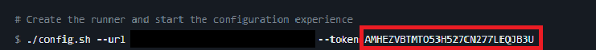

# GitHub Action Runner

## Egg Variables List
Here you can see all egg variable descriptions.

### GITHUB_CATEGORY
The name of the organization or repository path where you want to add the Github Action Runner.

### GITHUB_ACTION_RUNNER_NAME
The name of runner (visible in `Actions/Runners` in the organization or repository `Settings` page).

### GITHUB_ACTION_RUNNER_TOKEN
The token of the Github Runner Action follows [this steps]()

## Get GitHub Action Runner Token
Follow this steps to get your GitHub Action Runner Token
- Go to the `Settings` page of the organization or repository where you want to create the runner
- Click on `New self-hosted runner` button
- Scroll down to the `Configure` part and add the token is visible in the command in the egg variable:

## Warning
If you want to change the token of the GitHub Action Runner or delete them, you need to delete the server before.